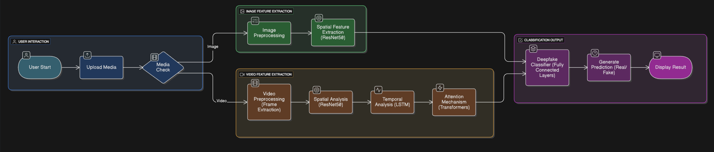

## Deepfake Detection & Protection: Safeguarding Images & Videos from AI-Generated Manipulations
The rapid advancement of generative AI has made authenticating digital content a critical challenge. This project establishes a robust, automated framework to detect hyper-realistic deepfakes in both static images and video sequences. By integrating ResNet (CNN) and Transformer architectures, the system resolves the threat of misinformation and identity theft, creating a scalable solution for media verification and digital forensics.

## Technical Architecture & Data Flow
The project utilizes a modular, multi-stage pipeline that transitions from raw media ingestion to high-precision classification.

Phase 1: Pre-processing & Feature Localization

- Media Acquisition: Accepts standard formats including JPG, PNG, MP4, and AVI.
- Intelligent Cropping: Employs MediaPipe for high-speed face detection, isolating facial regions to remove background noise.
- Temporal Sampling: For video content, frames are extracted at a target rate to capture movement patterns without overloading memory.
- Normalization: Resizes all extracted facial regions to a uniform 224x224 resolution to ensure consistent model input.

Phase 2: Dual-Pipeline Feature Extraction
The system processes data through two specialized paths to identify different types of forgery:

- Spatial Path (Images): Uses a ResNet50 (CNN) architecture to identify pixel-level inconsistencies such as unnatural skin textures, blending artifacts, and lighting mismatches.
- Temporal Path (Videos): Integrates Long Short-Term Memory (LSTM) networks  and Transformers to track frame-to-frame dependencies, analyze the global context, spotting irregular transitions like unnatural blinking or mismatched lip movements.

Phase 3: Contextual Fusion & Prediction
Designed for high-accuracy decision-making:

- Transformer Encoder: Learns global context and attention weights across processed features to enhance detection against sophisticated GAN and diffusion models.
- Ensemble Decision: Fuses spatial and temporal signals to produce a final classification of "Real" or "Fake".
- Explainable Output: Generates Grad-CAM heatmaps and attention maps to highlight specific manipulated regions for user transparency.

## Tech Stack
- Languages: Python, ReactJS
- Backend: FastAPI for high-performance asynchronous API management and model inference.
- Frontend: ReactJS for a dynamic, user-friendly media upload and result visualization dashboard.
- AI/ML Libraries: PyTorch for model training; Hugging Face Transformers for contextual analysis.
- Computer Vision: OpenCV and MediaPipe for real-time face tracking and frame extraction.

## Key Results

- High Reliability: Achieved an F1-Score of 0.8494 and 98% Recall on specific test datasets, ensuring no positive fake samples were missed.
- Optimized Performance: Processing time is targeted at under 500 milliseconds per video frame on GPU-accelerated hardware.
- Robust Accuracy: Outperformed traditional baseline models with a final training accuracy of 78.4%.
- Modular Scalability: The decoupled architecture allows for seamless updates as new deepfake generation techniques emerge.
